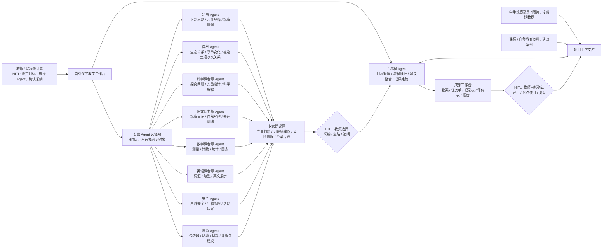

# 好奇自然多智能体探究教育平台商业计划书（初稿）

> 版本：v0.3  
> 日期：2026-09-03  
> 当前定位：10 个月产品化计划讨论稿，用于明确“做什么事、需要什么资源、需要多长时间”。

## 1. 项目摘要

“好奇自然多智能体探究教育平台”是一个面向儿童自然教育、科学探究和跨学科学习的 AI 平台。平台以真实自然观察活动为起点，例如校园昆虫观察、花坛生态观察、湿地生物观察、传感器环境数据采集等，将孩子在自然中的观察、提问、记录和数据转化为可执行的课程方案、探究任务、学习报告和成长档案。

平台采用“一个主流程 Agent + 多个专家建议 Agent”的协同架构。主流程 Agent 负责项目控制、流程推进、成果整合和最终定稿；昆虫、自然、科学、语文、数学、英语、安全、资源等专业 Agent 作为顾问角色存在，用户可以随时选择某个 Agent 进行交互，获取专业建议。专业 Agent 不直接修改最终教案或报告，而是将建议提交给主流程 Agent，由主流程 Agent 统一整合，保证最终成果结构清晰、风格统一、符合课程目标和安全边界。

项目以 10 个月形成可对外销售或规模化试点的产品为目标，建设一套“自然探究教学工作台”。产品先围绕“校园昆虫生态观察课”打通完整闭环：活动设计、现场观察、专家建议、跨学科转化、课程成果生成；随后扩展到多个自然探究主题，并接入课程包、学生观察记录、传感器数据导入、学校或机构项目管理等能力。

## 2. 我们在做什么事

### 2.1 核心目标

项目要解决的问题不是“让 AI 帮老师写一份教案”，而是建设一个能把自然教育中的多方资源组织起来的平台：

- 把真实自然观察转化为课程任务；
- 把孩子的观察记录转化为科学问题；
- 把昆虫、植物、土壤、气候、传感器等自然资源转化为可教学内容；
- 把科学、语文、数学、英语等学科要求转化为跨学科学习活动；
- 把老师、学生、自然教育基地、传感器设备、课程标准和教学成果连接到同一个流程中。

平台最终希望成为自然教育场景中的“项目调度中枢”。老师不再需要从零设计一节自然探究课，而是通过主流程 Agent 管理目标、流程和成果，通过多个专家 Agent 获得专业支持。

### 2.2 第一版产品形态

第一版产品建议定位为：

**自然探究多智能体教学工作台**

它面向老师、自然教育机构和研学课程设计者，提供一个围绕自然观察项目展开的工作界面。

核心功能包括：

- 创建自然探究项目，例如“校园昆虫生态观察”；
- 设置学生年级、活动地点、时间、材料和课程目标；
- 与主流程 Agent 对话，形成活动整体方案；
- 选择不同专家 Agent 获取建议；
- 将专家建议交给主流程 Agent 统一整合；
- 生成观察任务单、教案、学生记录表、跨学科活动设计、评价表和活动总结。

### 2.3 第一条标杆场景

第一条标杆场景建议选择：

**校园昆虫生态观察课**

这个场景足够具体，也足够有扩展性。它天然包含多个教育价值点：

- 科学：观察昆虫形态、行为、栖息环境，形成探究问题；
- 数学：记录数量、频次、温湿度、时间变化，形成表格和图表；
- 语文：撰写观察日记、自然笔记、说明性文字；
- 英语：学习昆虫、自然、观察动作相关词汇和表达；
- 安全：户外活动规范、避免伤害生物、避免危险接触；
- 资源：匹配放大镜、观察盒、温湿度传感器、记录表、场地。

通过这一条场景，可以完整展示平台不是单点工具，而是一个从自然观察到课程成果的工作流平台。

## 3. 产品架构

### 3.1 总体架构

平台采用三层架构：

1. **主流程 Agent**
   
   负责项目目标管理、流程推进、上下文维护、专家建议整合和成果定稿。

2. **专家建议 Agent**
   
   负责从不同专业角度提供建议，包括昆虫、自然、科学、语文、数学、英语、安全和资源等。

3. **成果工作台**
   
   负责承载最终输出，包括教案、观察任务单、学生记录表、数据分析表、跨学科活动方案和评价表。

### 3.2 整体 Agent 交互架构

图中的 HITL 表示 Human-in-the-loop，即人在关键节点参与判断。平台不让专家 Agent 自动覆盖最终成果，而是在三个位置保留人工控制：

- **任务入口 HITL**：教师设定项目目标、学生年级、场地、材料和预期成果；
- **专家选择 HITL**：教师决定咨询哪个专家 Agent，并判断建议是否有价值；
- **成果确认 HITL**：教师审核主流程 Agent 整合后的教案、任务单、记录表和报告，再用于真实课堂或试点活动。

这种设计保证了多 Agent 能力可以被充分调用，同时保留教师对课程目标、安全边界和最终教学成果的控制权。

### 3.3 Agent 角色设计

| Agent | 定位 | 主要能力 | 第一版实现方式 |
| --- | --- | --- | --- |
| 主流程 Agent | 项目控制与成果整合中心 | 目标设定、流程推进、建议整合、成果定稿 | 独立主提示词 + 项目上下文 + 草案生成 |
| 昆虫 Agent | 昆虫观察专家 | 昆虫识别思路、习性解释、观察提醒 | 角色提示词模板 |
| 自然 Agent | 自然生态专家 | 生态关系、季节变化、植物土壤水文关系 | 角色提示词模板 |
| 科学课老师 Agent | 科学探究专家 | 探究问题、实验设计、科学解释 | 角色提示词模板 |
| 语文课老师 Agent | 自然表达专家 | 观察日记、自然写作、表达训练 | 角色提示词模板 |
| 数学课老师 Agent | 数据分析专家 | 测量、计数、统计、图表 | 角色提示词模板 |
| 英语课老师 Agent | 英语表达专家 | 词汇、句型、英文展示 | 角色提示词模板 |
| 安全 Agent | 安全与伦理专家 | 户外安全、生物伦理、活动边界 | 角色提示词模板 |
| 资源 Agent | 活动资源匹配专家 | 传感器、场地、材料、课程包建议 | 角色提示词模板 |

第一版中，除主流程 Agent 外，其他 Agent 均采用统一的建议型交互机制。它们共享同一套路由、上下文、消息保存和前端交互模式，只通过角色提示词区分能力边界。

### 3.4 协同机制

平台采用“专家建议，主控整合”的协同机制：

- 用户默认与主流程 Agent 对话；
- 用户可以主动选择任意专家 Agent 进行咨询；
- 专家 Agent 的回答进入建议区或消息流；
- 专家 Agent 不直接改写最终教案、任务单或报告；
- 用户可以要求主流程 Agent 吸收某条或多条专家建议；
- 主流程 Agent 根据课程目标、学生年龄、上下文和安全要求进行整合；
- 最终成果由主流程 Agent 生成、维护和定稿。

这种机制的好处是既能展示多 Agent 协作能力，又能避免多个 Agent 同时修改成果导致的混乱。

## 4. 核心产品功能

### 4.1 项目创建

用户可以创建一个自然探究项目，并填写基础信息：

- 项目主题；
- 学生年级；
- 活动地点；
- 活动时长；
- 可用材料；
- 可用传感器；
- 课程目标；
- 预期成果。

### 4.2 主流程对话

主流程 Agent 负责引导用户完成整个自然探究项目设计，包括：

- 明确活动目标；
- 拆解活动阶段；
- 形成观察任务；
- 判断需要哪些专家建议；
- 整合专家建议；
- 生成最终成果。

### 4.3 专家 Agent 交互

用户可以在专家面板中选择任意专家 Agent，并围绕当前项目上下文提问。

示例：

- 问昆虫 Agent：“孩子发现一只瓢虫停在叶子背面，可以引导他们观察什么？”
- 问科学课老师 Agent：“这个现象可以转成什么探究问题？”
- 问数学课老师 Agent：“学生记录了不同时间段昆虫数量，适合做什么图表？”
- 问语文课老师 Agent：“怎样让孩子把观察写成自然笔记？”
- 问安全 Agent：“这次户外活动需要提醒哪些风险？”

### 4.4 建议沉淀

专家 Agent 的输出需要沉淀为可被主流程 Agent 引用的建议内容。建议内容可以包含：

- 专业判断；
- 可采纳建议；
- 风险提醒；
- 可加入成果草案的片段。

第一版可以先用普通消息保存，后续再升级为结构化建议卡片。

### 4.5 成果生成

主流程 Agent 可以基于项目上下文和专家建议生成以下成果：

- 教师活动方案；
- 学生观察任务单；
- 昆虫观察记录表；
- 传感器数据记录表；
- 跨学科任务设计；
- 学生自然笔记模板；
- 活动安全说明；
- 课程评价表；
- 活动总结报告。

## 5. 需要什么资源

### 5.1 人员资源

第一阶段建议配置一个小型产品研发小组：

| 角色 | 人数 | 主要职责 |
| --- | --- | --- |
| 产品负责人 | 1 | 定义产品方向、试点场景、客户需求和交付范围 |
| 后端工程师 | 1 | Agent 路由、会话、权限、RAG、数据模型和接口 |
| 前端工程师 | 1 | 教学工作台、专家面板、成果区、交互体验 |
| AI Prompt / Agent 设计 | 1 | 主流程 Agent 和各专家 Agent 的提示词设计 |
| 自然教育专家 | 1 | 自然观察活动设计、昆虫观察规范、课程内容审核 |
| 一线教师顾问 | 2-3 | 提供真实教学需求、试用反馈和课程验证 |
| 运营/商务 | 1 | 试点学校、自然教育机构和合作资源对接 |

如果预算有限，启动期可以采用精简配置：

- 1 名全栈工程师；
- 1 名产品/项目负责人；
- 1 名自然教育或科学教育专家；
- 2 名兼职教师顾问。

### 5.2 技术资源

需要准备的技术资源包括：

- 大模型调用服务；
- 多 Agent 对话与路由系统；
- 用户、会话和项目数据存储；
- 课程标准与自然教育资料知识库；
- 文件上传和资料解析能力；
- 草案生成与导出能力；
- 前端教学工作台；
- 日志、错误追踪和基础运维能力。

当前项目已经具备部分基础：

- FastAPI 后端；
- Vue 3 前端；
- 用户登录和会话隔离；
- 主流程 Agent 与阶段 Agent 的协作雏形；
- SSE 流式对话；
- 课程标准 RAG；
- 文件上传与文本提取；
- 草案生成和导出能力。

后续重点不是从零开发，而是把当前“阶段绑定 Agent”形态调整为“主流程 Agent + 可选专家 Agent”形态。

### 5.3 内容资源

平台需要持续建设内容资源：

- 国家课程标准；
- 科学、语文、数学、英语跨学科教学要求；
- 昆虫和自然生态基础知识；
- 校园自然观察活动案例；
- 传感器使用说明；
- 户外安全规范；
- 学生观察记录模板；
- 教师教案模板；
- 活动评价量表。

第一阶段不追求建设完整自然百科库，而是围绕“校园昆虫生态观察课”整理一批高质量示例内容。

### 5.4 硬件与场地资源

第一版产品化和试点建议准备：

- 放大镜；
- 昆虫观察盒；
- 温湿度传感器；
- 光照传感器；
- 土壤湿度传感器；
- 学生记录纸或平板；
- 校园花坛、草地、小树林等观察场地；
- 一套标准化活动材料包。

传感器第一阶段可以先做“数据录入和样例数据展示”，不必立即实现硬件实时接入。等试点稳定后，再接入真实设备数据。

### 5.5 合作资源

需要重点寻找的合作方包括：

- 小学或初中试点学校；
- 自然教育机构；
- 科普场馆；
- 校园劳动教育或科学教育项目；
- 传感器设备厂商；
- 区域教育信息化服务商。

第一阶段最重要的是找到 1-3 个愿意共同打磨课程的试点单位。

## 6. 需要多长时间

### 6.1 总体时间判断

项目当前目标是形成可以对外销售或规模化试点的产品，建议周期为 **10 个月**。这个周期的重点不是只做演示样机，也不是一次性建设完整平台，而是完成一个可以真实交付给学校、自然教育机构或研学机构使用的产品版本。

10 个月结束时，产品需要达到以下状态：

- 能支持多个自然探究主题，而不是只支持单一案例；
- 能完成从项目创建、专家咨询、建议沉淀到成果生成的闭环；
- 能让教师在真实备课和试点活动中持续使用；
- 能沉淀课程包、学生观察记录、传感器数据和活动成果；
- 能支持学校或机构维度的基础管理；
- 能形成明确报价、试点交付和售后支持方式。

### 6.2 十个月产品化计划

#### 第 1-2 个月：产品形态重构与核心 Agent 能力

目标：完成从“阶段绑定 Agent”到“主流程 Agent + 专家 Agent”的产品和技术改造。

主要任务：

- 明确主流程 Agent 的职责和提示词；
- 建立专家 Agent 配置表；
- 接入昆虫、自然、科学、语文、数学、英语、安全、资源 Agent；
- 支持用户选择某个专家 Agent 对话；
- 保留每个 Agent 在同一项目中的独立对话记忆；
- 初步改造前端，形成专家选择面板。

阶段成果：

- 可创建自然探究项目；
- 可与主流程 Agent 对话；
- 可选择任意专家 Agent 对话；
- 专家 Agent 能基于当前项目上下文给出建议。

#### 第 3-4 个月：成果工作台与标杆课程场景

目标：围绕“校园昆虫生态观察课”打通课程成果生成闭环。

主要任务：

- 设计校园昆虫观察课标准流程；
- 建设昆虫观察、科学探究、语文表达、数学记录、安全提醒等提示词模板；
- 建设观察任务单、记录表、教案和评价表模板；
- 支持主流程 Agent 整合专家建议；
- 支持生成 Markdown 课程成果；
- 整理第一批样例资料和样例数据。

阶段成果：

- 一条完整标杆课程演示；
- 一份教师活动方案；
- 一份学生观察任务单；
- 一份数据记录表；
- 一份跨学科活动设计；
- 一份安全说明和评价表。

#### 第 5-7 个月：多主题课程包与试点能力

目标：从单一标杆场景扩展到多个可交付主题，并让产品具备规模化试点所需的稳定性。

主要任务：

- 邀请教师顾问试用；
- 根据反馈优化 Agent 回答风格和成果格式；
- 补充校园植物观察、土壤与水分观察、季节变化观察等自然教育案例；
- 增加项目导出、分享和版本管理能力；
- 支持学生观察记录和传感器样例数据导入；
- 支持学校或机构维度的项目归档；
- 建立教师和学生两类使用视角；
- 建立内容审核与安全检查机制。

阶段成果：

- 支持多个自然探究主题；
- 建设更多课程包；
- 支持学生观察记录收集；
- 支持传感器数据导入；
- 支持学校或机构维度的项目管理；
- 增加权限、日志、数据导出和运营后台；
- 建立内容审核与安全机制。

#### 第 8-10 个月：对外销售与规模化试点准备

目标：完成产品化包装、试点交付体系和初步商业化准备。

主要任务：

- 完成产品介绍、演示脚本和销售材料；
- 建立试点学校和自然教育机构交付流程；
- 明确标准报价、服务边界和实施周期；
- 完善教师培训材料和使用说明；
- 增加运营后台、日志、基础权限和数据导出能力；
- 打磨 3-5 个可复制课程包；
- 与 3-5 个学校、机构或科普场馆推进规模化试点。

阶段成果：

- 可对外销售的产品版本；
- 标准化试点交付包；
- 3-5 个标杆试点案例；
- 初步收入或明确采购意向；
- 下一轮产品化和融资所需的真实数据。

## 7. 商业模式

### 7.1 第一阶段商业模式

第一阶段建议采用“试点项目 + 平台服务”的模式：

- 面向学校提供自然探究课程试点；
- 面向自然教育机构提供 AI 课程设计工具；
- 面向研学机构提供课程生成和活动方案支持；
- 按项目收取试点服务费；
- 同时积累课程模板和真实使用案例。

### 7.2 第二阶段商业模式

产品稳定后，可以形成标准化收费：

- 学校 SaaS 年费；
- 教师账号订阅；
- 课程包收费；
- 研学机构平台服务费；
- 传感器和材料包配套销售；
- 定制化区域项目建设服务。

### 7.3 第三阶段商业模式

平台成熟后，可以拓展为区域级自然教育基础设施：

- 区域自然教育数据平台；
- 科学教育数字化项目；
- 教育局或科普机构项目制合作；
- 自然教育基地资源调度服务；
- 学生科学素养评估与成长档案服务。

## 8. 竞争优势

### 8.1 不只是 AI 教案工具

普通 AI 教案工具主要解决文本生成问题。本平台关注的是自然教育全过程，包括真实观察、数据采集、专家建议、跨学科转化和成果沉淀。

### 8.2 多 Agent 分工明确

平台不是让一个大模型回答所有问题，而是通过主流程 Agent 和多个专家 Agent 进行角色化协作。专业 Agent 提供建议，主流程 Agent 负责整合，既有专业分工，也有统一控制。

### 8.3 贴近真实自然教育场景

平台从昆虫观察、校园自然、传感器数据和跨学科学习任务出发，能服务真实课堂和真实户外活动。

### 8.4 可从工具演进为平台

第一版可以作为教学工作台使用，后续可以接入场地、设备、课程包、学生数据和区域自然观察数据，逐步形成资源整合与调度能力。

## 9. 落地路径

### 9.1 首批试点

首批试点建议选择：

- 1 所小学；
- 1 所初中；
- 1 个自然教育机构或科普场馆。

试点主题统一从“校园昆虫生态观察课”开始，便于标准化打磨和对比反馈。

### 9.2 试点交付内容

每个试点单位交付：

- 一套自然观察活动方案；
- 一套学生观察任务单；
- 一套教师使用说明；
- 一套跨学科成果模板；
- 一次教师培训；
- 一次活动复盘报告。

### 9.3 试点评价指标

建议从以下指标评估试点效果：

- 教师备课时间是否减少；
- 学生活动参与度是否提高；
- 学生观察记录质量是否提升；
- 是否产出可展示的学生作品；
- 教师是否愿意再次使用；
- 学校或机构是否愿意继续采购。

## 10. 阶段性资源预算

### 10.1 十个月产品化资源预算

10 个月产品化阶段建议准备：

- 研发与产品人员投入；
- 大模型调用费用；
- 服务器与基础运维费用；
- 课程内容整理费用；
- 教师顾问费用；
- 简单传感器和观察材料费用；
- 演示材料制作费用。
- 前后端工程投入；
- 课程内容建设投入；
- 试点运营投入；
- 用户支持投入；
- 数据安全和权限体系投入；
- 设备接入与合作对接投入。

在精简团队情况下，前期可以采用“小团队快速验证 + 后期试点交付扩充”的方式，不建议一开始投入过重硬件和平台化基础设施。资源投入应优先保障产品闭环、课程内容质量、教师试点反馈和可复制交付能力。

### 10.2 后续平台化预留资源

10 个月产品化版本完成后，后续平台化需要预留以下资源方向：

- 多学校和多机构管理能力；
- 设备数据接入和维护；
- 区域数据看板；
- 合规、安全和隐私保护；
- 商务拓展和项目交付团队；
- 内容审核和专家资源体系。

## 11. 风险与应对

| 风险 | 说明 | 应对方式 |
| --- | --- | --- |
| 产品范围过大 | 多 Agent、传感器、课程、平台调度同时推进容易失焦 | 第一阶段只打通一个标杆场景 |
| Agent 回答不稳定 | 不同专家 Agent 可能风格不统一 | 专家只给建议，主流程 Agent 统一整合 |
| 教师使用门槛高 | 老师可能不愿学习复杂系统 | 工作台围绕“创建项目、提问、生成成果”设计 |
| 内容准确性风险 | 昆虫识别和自然知识可能出错 | 引入自然教育专家审核，重要结论保留提示 |
| 安全风险 | 户外活动涉及儿童安全和生物伦理 | 安全 Agent 常驻，成果中强制加入安全边界 |
| 硬件接入复杂 | 真实传感器协议和设备稳定性不一 | 第一阶段先做数据录入和样例数据，后续再接真实设备 |
| 商业化不清晰 | 学校采购、机构采购、项目制交付路径不同 | 先用试点项目验证付费主体和采购流程 |

## 12. 当前结论

项目当前最适合采取“10 个月产品化闭环，大平台长期叙事”的策略。

10 个月内，先把产品做成一个可对外销售、可规模化试点的自然探究教学工作台，用“校园昆虫生态观察课”建立标杆，再扩展多个自然教育主题、课程包、学生记录和传感器数据导入能力。长期再建设资源调度、区域数据和自然教育生态协同能力。

第一阶段的成功标准不是 Agent 数量多少，而是能否让用户清楚看到：

- 平台正在做一件真实有价值的事；
- 老师可以用它更快设计自然探究课程；
- 学生的自然观察可以转化为跨学科学习成果；
- 多个专家 Agent 的建议可以被主流程 Agent 有序整合；
- 这个系统未来有机会从教学工具成长为自然教育资源调度平台。
